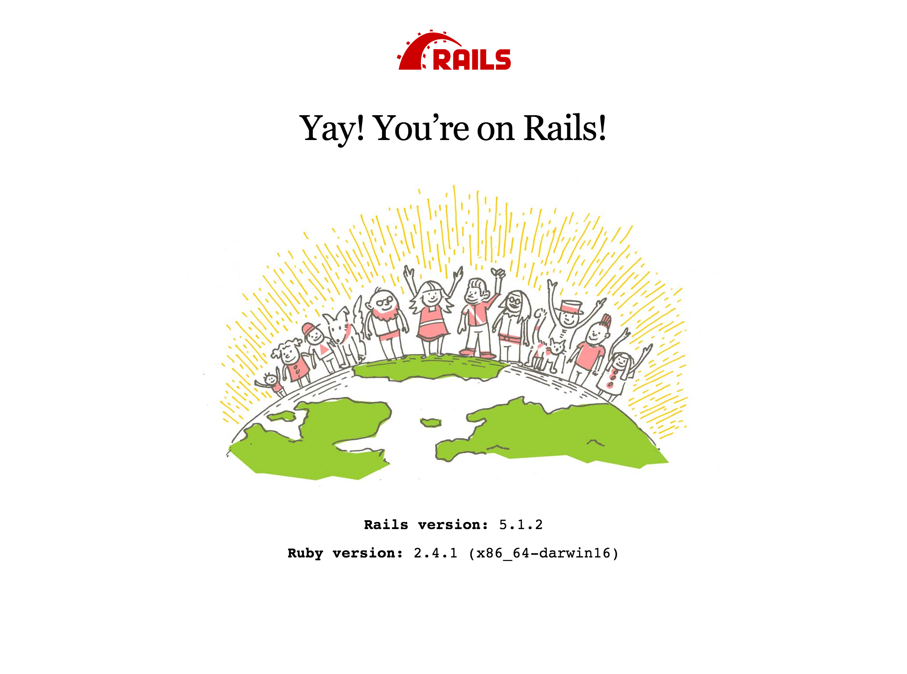

# Flickr Clone
### Steven Galvin, July 5th, 2017

This is a clone of the website flickr. I made this using Ruby on Rails to practice my skills with the gems Devise (for user authentication), Paperclip (for adding files), and FactoryGirl (for building factory tests). It is a simple photo sharing social platform for users to add photos with tags, tag each other in photos, favorite photos, and add comments. Users have profiles that they can view their photos, photos they've been tagged in, and photos they have favorited as well as having CRUD functionality over their photos, tags, and comments. Testing will be covered with SimpleCov to make sure at least 80% of my sight has been succesfully tested.

## Landing Page:

## Planning

### 1. Configuration/dependencies
  The app will primarily use Ruby on Rails and the SQL database. User authentication is made with the Devise gem and files are added with the assistance of the Paperclip gem. It was made with what I learned from week 2 of Epicodus' Rails course. Styled with bootstrap and SASS.

  Future plans include:
  * Hosting the site live
  * Updating the style of the page

### 2. User Stories
  * As a user, I'd like to create an account.
  * As a user, I'd like CRUD functionality over photos added on my account.
  * As a user, I'd like CRUD functionality over tags added to photos on my account.
  * As a user, I'd like to tag other users in my photos.
  * As a user, I'd like to have a profile page that displays my photos.
  * As a user, I'd like to have a way to display photos I'm tagged in(i.e. on profile page home feed or in a separate section of profile page.).
  * As a user, I'd like to be able to 'favorite' photos and have a section on my profile page that displays my favorited photos.
  * As a user, I'd like to be able to have CRUD functionality over comments on photos.

### 3. Integration
  * Root component/Index page with signup or signin fields
  * Dynamic profile pages using authentication to determine the specific user
  * Home feed to display all users photos for others to interact with

  Stretch Goals:
  * About page for information regarding the app
  * Contact page to reach out to me

### 4. UX/UI
  * Include Bootstrap & SASS

### 5. Polish
  * Refactor code.
  * Delete unused code.
  * Make README awesome.

## Prerequisites

You will need the following things properly installed on your computer.

* [Git](https://git-scm.com/)
* [Node.js](https://nodejs.org/) (with NPM)
* [Ruby](https://www.ruby-lang.org/en/downloads/)
* [Rails](http://rubyonrails.org/)
* [Postgres](https://www.learnhowtoprogram.com/ruby/ruby-database-basics/installing-postgres-7fb0cff7-a0f5-4b61-a0db-8a928b9f67ef) (here's a good lesson online for setting it up)

## Installation

As of writing this README, these instructions work on MacOS.

* Run `$ git clone <this-repository-url>`
* Then `$ cd flickr_clone`
* Once in the flickr_clone folder, run `bundle install` to install gems, `$ rails db:create` to create the database, `$ rails db:migrate` to create the schema, `$ rails db:seed` to populate the database, and `$ rails s` to run the server. Then visit http://localhost:3000/ to view the app.

## Built With

* Ruby ~> 2.4.1
* Rails ~> 5.1
* SQL
* HTML
* CSS/SASS
* Bootstrap https://getbootstrap.com/
* Jquery https://jquery.com/
* Node
* Bower
* FactoryGirl
* Paperclip
* Devise

## Authors

Steven Galvin

## License

MIT License

Copyright (c) Steven Galvin, 2017

Permission is hereby granted, free of charge, to any person obtaining a copy
of this software and associated documentation files (the "Software"), to deal
in the Software without restriction, including without limitation the rights
to use, copy, modify, merge, publish, distribute, sublicense, and/or sell
copies of the Software, and to permit persons to whom the Software is furnished to do so, subject to the following conditions:

The above copyright notice and this permission notice shall be included in all
copies or substantial portions of the Software.

THE SOFTWARE IS PROVIDED "AS IS", WITHOUT WARRANTY OF ANY KIND, EXPRESS OR
IMPLIED, INCLUDING BUT NOT LIMITED TO THE WARRANTIES OF MERCHANTABILITY,
FITNESS FOR A PARTICULAR PURPOSE AND NONINFRINGEMENT. IN NO EVENT SHALL THE
AUTHORS OR COPYRIGHT HOLDERS BE LIABLE FOR ANY CLAIM, DAMAGES OR OTHER
LIABILITY, WHETHER IN AN ACTION OF CONTRACT, TORT OR OTHERWISE, ARISING FROM,
OUT OF OR IN CONNECTION WITH THE SOFTWARE OR THE USE OR OTHER DEALINGS IN THE
SOFTWARE.
